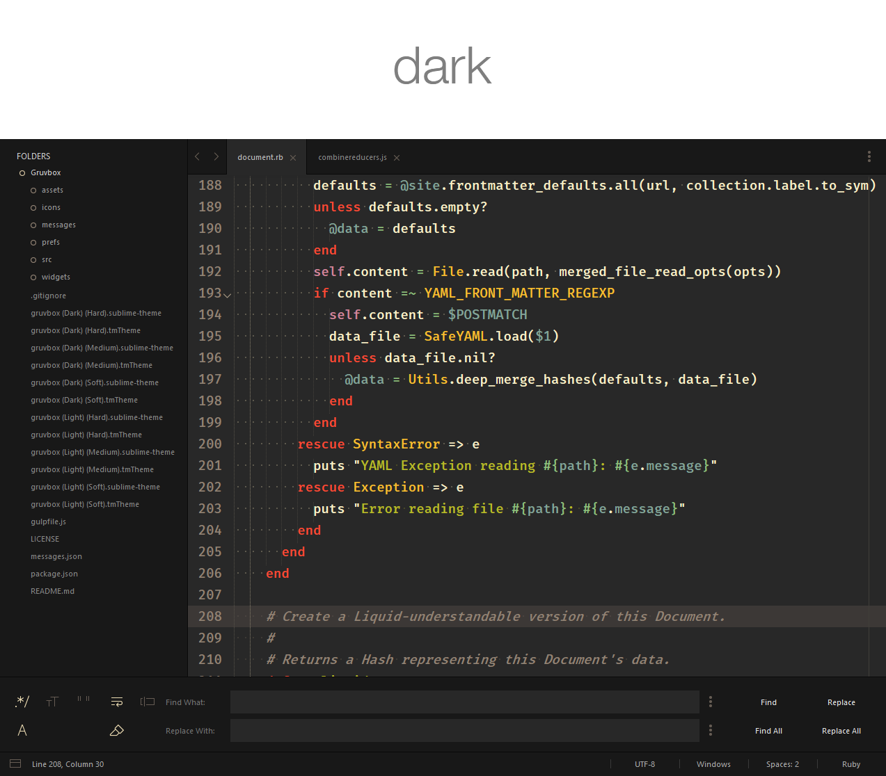
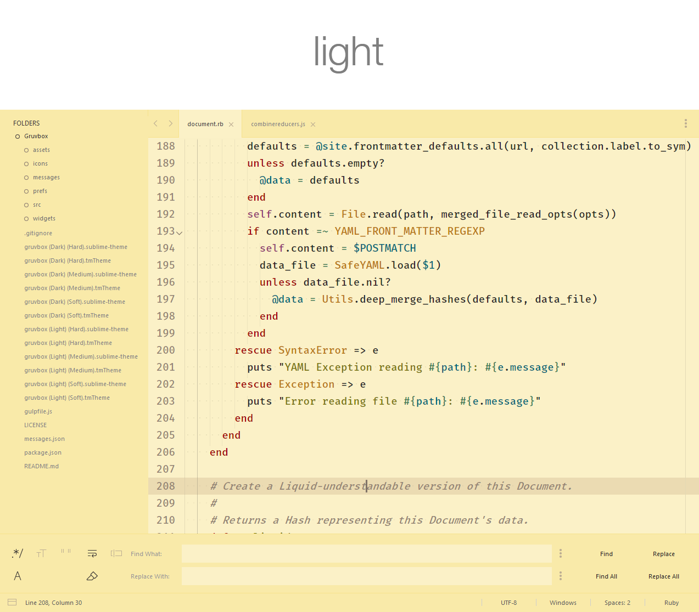
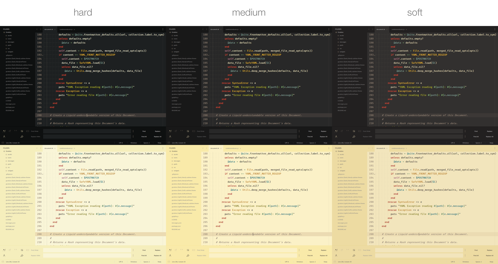
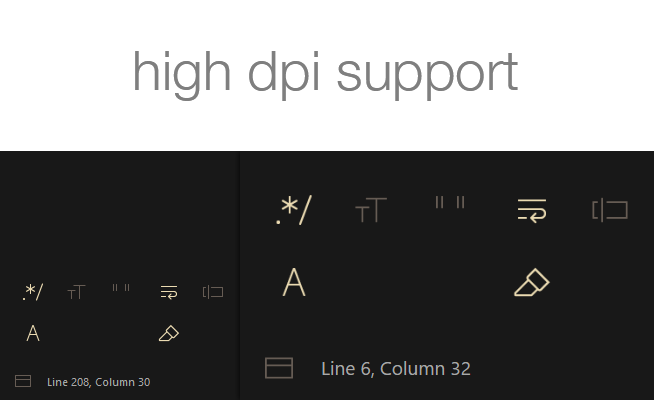
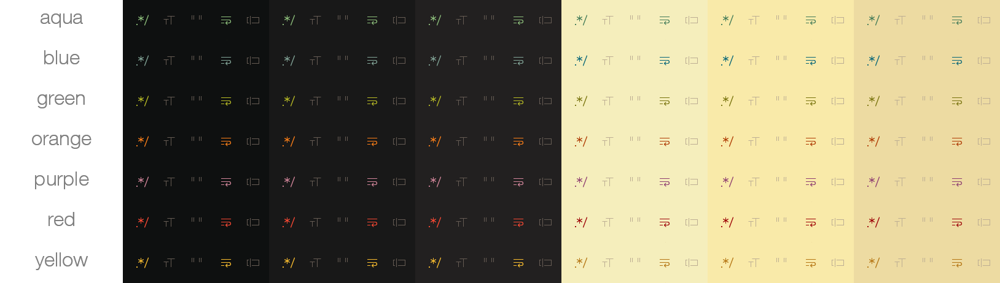
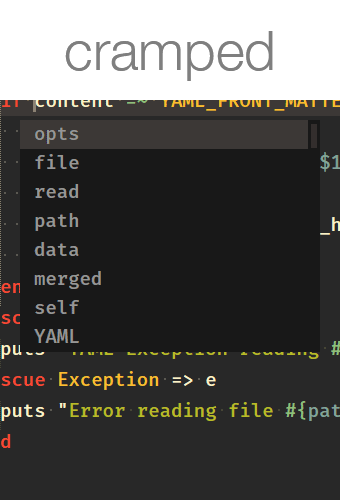
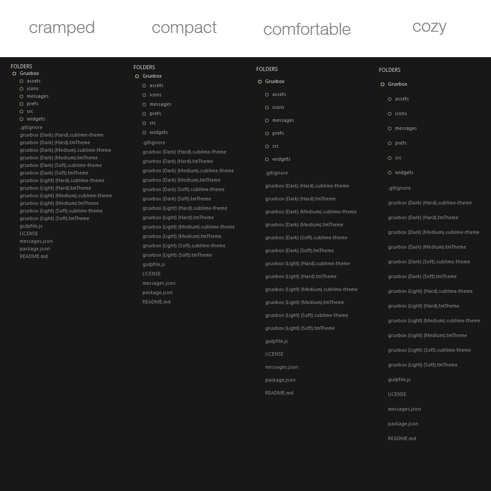

Based on [gruvbox for vim](https://github.com/morhetz/gruvbox)

> gruvbox is heavily inspired by [badwolf][], [jellybeans][] and [solarized][].

> Designed as a bright theme with pastel 'retro groove' colors and light/dark mode switching in the way of [solarized][]. The main focus when developing gruvbox is to keep colors easily distinguishable, contrast enough and still pleasant for the eyes.

   [badwolf]: https://github.com/sjl/badwolf
   [jellybeans]: https://github.com/nanotech/jellybeans.vim
   [solarized]: http://ethanschoonover.com/solarized

> &mdash; <cite>[Pavel Pertsev](https://github.com/morhetz), creator of gruvbox for vim</cite>




Contrast options
----------------



Monospaced font used in screenshots is [Fira Mono Medium](https://github.com/mozilla/Fira)

Palette
-------

### Dark mode


### Light mode


--------------------------------------------------------------------------------

Features
--------

* Lots of customization options
* Support for High-DPI displays
* Support for:
    * [GitGutter](https://packagecontrol.io/packages/GitGutter)
    * [Bracket Highlighter](https://packagecontrol.io/packages/BracketHighlighter)
    * [SublimeLinter](https://packagecontrol.io/packages/SublimeLinter)
    * [Markdown Extended](https://packagecontrol.io/packages/Markdown%20Extended)
* Support for the latest Sublime Text features



Installation
------------

#### Package Control

The easiest way to install is using [Package Control](https://packagecontrol.io/)


1. Open Command Palette using menu item `Tools -> Command Palette...` (<kbd>⇧</kbd><kbd>⌘</kbd><kbd>P</kbd> on Mac) (<kbd>ctrl</kbd><kbd>shift</kbd><kbd>P</kbd> on Windows)
2. Choose `Package Control: Install Package`
3. Find `gruvbox` and hit <kbd>Enter</kbd>
4. [Activate the theme](#how-to-activate) by adding the code below to *Preferences > Setting - User*:
5. Restart Sublime Text

#### Manual

You can also install the theme manually:

1. [Download the .zip](https://github.com/briles/gruvbox/archive/master.zip)
2. Unzip and rename the folder to `gruvbox`
3. Copy the folder into `Packages` directory, which you can find using the menu item `Sublime Text -> Preferences -> Browse Packages...`
4. [Activate the theme](#how-to-activate) by adding the code below to *Preferences > Setting - User*:
5. Restart Sublime Text

How to Activate
---------------

Activate the UI theme and color scheme by modifying your user preferences file, which you can find using the menu item `Sublime Text -> Preferences -> Settings - User` (<kbd>⌘</kbd><kbd>,</kbd> on Mac).

*Note: Don't forget to restart Sublime Text after activating the theme.*


```json
// gruvbox Dark Hard Contrast
{
  "theme": "gruvbox (Dark) (Hard).sublime-theme",
  "color_scheme": "Packages/gruvbox/gruvbox (Dark) (Hard).tmTheme",
}


// gruvbox Dark Medium Contrast
{
  "theme": "gruvbox (Dark) (Medium).sublime-theme",
  "color_scheme": "Packages/gruvbox/gruvbox (Dark) (Medium).tmTheme",
}


// gruvbox Dark Soft Contrast
{
  "theme": "gruvbox (Dark) (Soft).sublime-theme",
  "color_scheme": "Packages/gruvbox/gruvbox (Dark) (Soft).tmTheme",
}


// gruvbox Light Hard Contrast
{
  "theme": "gruvbox (Light) (Hard).sublime-theme",
  "color_scheme": "Packages/gruvbox/gruvbox (Light) (Hard).tmTheme",
}


// gruvbox Light Medium Contrast
{
  "theme": "gruvbox (Light) (Medium).sublime-theme",
  "color_scheme": "Packages/gruvbox/gruvbox (Light) (Medium).tmTheme",
}


// gruvbox Light Soft Contrast
{
  "theme": "gruvbox (Light) (Soft).sublime-theme",
  "color_scheme": "Packages/gruvbox/gruvbox (Light) (Soft).tmTheme",
}
```

Settings
--------

#### Accent Colors



Enable accent color by setting the appropriate key to `true`
Accent colors affect icons and certain text.

```json
  "gruvbox_accent_aqua": true,
  "gruvbox_accent_blue": true,
  "gruvbox_accent_green": true,
  "gruvbox_accent_orange": true,
  "gruvbox_accent_purple": true,
  "gruvbox_accent_red": true,
  "gruvbox_accent_yellow": true,
```

#### AutoComplete Spacing



Change the space between autocomplete rows

```json
   // sizes are top/bottom in px
  "gruvbox_autocomplete_cozy": true,         //  v  2
  "gruvbox_autocomplete_comfortable": true,  //  |  4
                                             //  |  6 (Default)
  "gruvbox_autocomplete_compact": true,      //  |  8
  "gruvbox_autocomplete_cramped": true,      //  v  10
```

#### Sidebar Spacing



Change the space between sidebar tree rows

```json
   // sizes are top/bottom in px
  "gruvbox_sidebar_cozy": true,         //  v  1
  "gruvbox_sidebar_comfortable": true,  //  |  3
                                        //  |  5 (Default)
  "gruvbox_sidebar_compact": true,      //  |  7
  "gruvbox_sidebar_cramped": true,      //  v  9
```

#### Statusbar Sizes

Change the height of the statusbar

```json
   // sizes are in px
  "gruvbox_statusbar_xxs": true,  //  v  20
  "gruvbox_statusbar_xs": true,   //  |  25
  "gruvbox_statusbar_s": true,    //  |  30
                                  //  |  35 (Default)
  "gruvbox_statusbar_l": true,    //  |  40
  "gruvbox_statusbar_xl": true,   //  |  45
  "gruvbox_statusbar_xxl": true,  //  v  50
```

#### Tab Sizes

Change the height of the tabs

```json
   // sizes are in px
  "gruvbox_tabs_xxs": true,  //  v  33
  "gruvbox_tabs_xs": true,   //  |  39
  "gruvbox_tabs_s": true,    //  |  45
                             //  |  51 (Default)
  "gruvbox_tabs_l": true,    //  |  57
  "gruvbox_tabs_xl": true,   //  |  63
  "gruvbox_tabs_xxl": true,  //  v  69
```

#### Tab Font Sizes

Change the font size of the tabs

```json
  "gruvbox_tabs_font_size_7": true,   //  v  7
  "gruvbox_tabs_font_size_8": true,   //  |  8
  "gruvbox_tabs_font_size_9": true,   //  |  9
  "gruvbox_tabs_font_size_10": true,  //  |  10
                                      //  |  11 (Default)
  "gruvbox_tabs_font_size_12": true,  //  |  12
  "gruvbox_tabs_font_size_13": true,  //  |  13
  "gruvbox_tabs_font_size_14": true,  //  |  14
  "gruvbox_tabs_font_size_15": true,  //  v  15
```

#### Even More Settings...

```json
  "gruvbox_disable_fileicons": true,          // Disable the sidebar file icons
  "gruvbox_disable_folder_icons": true,       // Disable the sidebar folder icons
  "gruvbox_disable_borders": true,            // Disable all borders
  "gruvbox_enable_panel_close_button": true,  // Enable the panel close button
  "gruvbox_enable_statusbar_border": true,    // Enable borders for the status bar
  "gruvbox_tabs_bold": true,                  // Enable bold tabs
  "gruvbox_tabs_autowidth": true,             // Auto-size the tabs
```

License
-------

[MIT](https://en.wikipedia.org/wiki/MIT_License)

Thanks
------

Thanks to:

* [Pavel Pertsev](https://github.com/morhetz) for creating gruvbox for vim.
* [Will Bond](https://github.com/wbond) for the mathematical [Package Control](https://packagecontrol.io/)
* [Spacegray](http://kkga.github.io/spacegray/) and [Material Theme](http://equinusocio.github.io/material-theme) for inspiration
